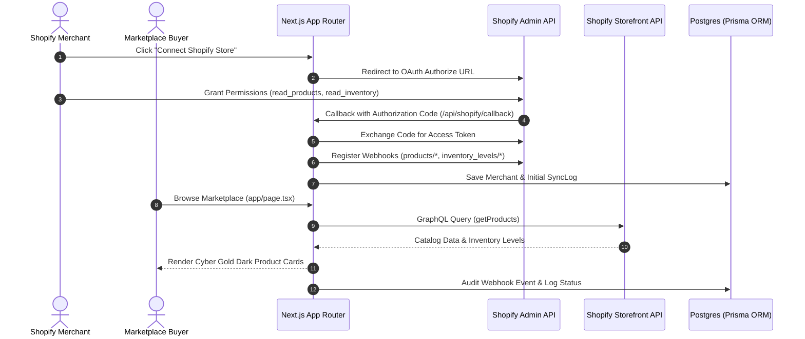

# System Architecture & Technical Specifications

The **Masters' Union Shopify Marketplace Platform** is an institutional multi-vendor product catalog marketplace. It aggregates, normalizes, and lists products and assets from multiple connected Shopify stores via Shopify Storefront GraphQL & Admin Webhook APIs.

---

## 🏛️ 1. High-Level Architecture Overview

The system follows an **Event-Driven Next.js App Router Architecture** integrated with a **PostgreSQL Database managed via Prisma ORM**.



---

## 🗄️ 2. Database Schema (`prisma/schema.prisma`)

```prisma
datasource db {
  provider = "postgresql"
  url      = env("DATABASE_URL")
}

generator client {
  provider = "prisma-client-js"
}

enum MerchantStatus {
  ACTIVE
  PENDING
  DISCONNECTED
}

enum ListingStatus {
  AVAILABLE
  RESERVED
  SOLD
}

model Merchant {
  id              String         @id @default(uuid())
  name            String
  myshopifyDomain String         @unique
  accessToken     String?
  status          MerchantStatus @default(PENDING)
  storeLogo       String?
  totalProducts   Int            @default(0)
  createdAt       DateTime       @default(now())
  updatedAt       DateTime       @updatedAt

  listings Listing[]
  syncLogs SyncLog[]

  @@map("merchants")
}

model Listing {
  id                String        @id @default(uuid())
  slotNumber        String        @unique
  title             String
  description       String        @db.Text
  category          String
  price             Float
  compareAtPrice    Float?
  inventoryQuantity Int           @default(0)
  status            ListingStatus @default(AVAILABLE)
  shopifyProductId  String        @unique
  shopifyVariantId  String
  merchantId        String
  merchant          Merchant      @relation(fields: [merchantId], references: [id], onDelete: Cascade)
  tags              String[]
  images            String[]
  variants          Json?
  sku               String?
  createdAt         DateTime      @default(now())
  updatedAt         DateTime      @updatedAt

  @@map("listings")
  @@index([category])
  @@index([status])
  @@index([merchantId])
}

model SyncLog {
  id           String   @id @default(uuid())
  merchantId   String
  merchant     Merchant @relation(fields: [merchantId], references: [id], onDelete: Cascade)
  eventType    String
  status       String
  payload      Json?
  errorMessage String?
  createdAt    DateTime @default(now())

  @@map("sync_logs")
  @@index([merchantId])
  @@index([createdAt])
}
```

---

## 💻 3. Component Hierarchy & Directory Tree

```
app/
 ├── layout.tsx                # Root layout (Metadata, Fonts, Pure Black Base)
 ├── globals.css               # Cyber Gold Tokens & Glassmorphism Utilities
 ├── page.tsx                  # Main product-centric marketplace page
 └── api/
      ├── shopify/
      │    ├── auth/route.ts   # OAuth Initiation
      │    ├── callback/route.ts# OAuth Exchange & Webhook Registration
      │    └── sync/route.ts   # Catalog Re-Sync API
      └── webhooks/
           └── shopify/route.ts# HMAC Verification & Webhook Ingestion

components/
 ├── Header.tsx                # Glassmorphic navbar with clickable GIF logo & store trigger
 ├── Hero.tsx                  # Contained video hero card section
 ├── VendorFilterBar.tsx       # Left sidebar filter pane (Search, Category dropdown, Vendor dropdown, Sort)
 ├── ListingCard.tsx           # Obsidian product card (Image, Title, Price, Vendor Badge, Inspect Link)
 ├── ListingDrawer.tsx         # Framer Motion 3-Tab slide-out drawer featuring Masters Union logo
 ├── BackgroundVideo.tsx       # Contained hero video component & toggle controls bar
 └── ConnectStoreModal.tsx     # OAuth store connection modal

public/assets/
 ├── masters_union_dropshipping_v1.mp4 # Scrollable ambient background video
 └── logoanimationblack.gif    # Animated header logo
```

---

## ⚡ 4. Failure Invariants & Graceful Fallback Strategy

1. **API Offline Fallback**: If Shopify Storefront API credentials are missing or external endpoints fail, the app gracefully falls back to [`data/mock-slots.ts`](file:///d:/lab/projects/dropshipping-marketplace/data/mock-slots.ts) to guarantee zero UI downtime.
2. **HMAC Signature Verification**: Webhooks without a valid `x-shopify-hmac-sha256` signature are rejected immediately with HTTP 401.
3. **Database Cascade Safety**: Deleting a `Merchant` cascades deletion to associated `Listing` items and `SyncLog` audit records.
