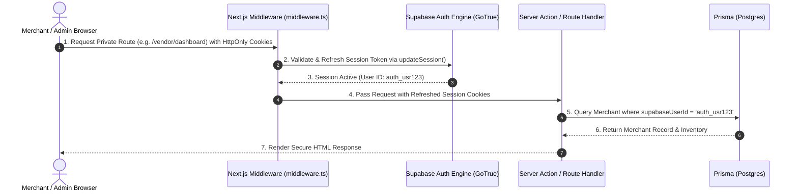
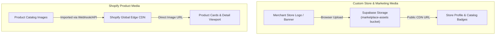

# System Architecture & Technical Specifications

The **Masters' Union Shopify Multi-Vendor Marketplace Platform** is an institutional B2B dropshipping catalog and multi-vendor platform. It aggregates, normalizes, and lists products and assets from multiple connected Shopify stores via Shopify Storefront GraphQL & Admin Webhook APIs, powered by a **Supabase PostgreSQL database**, **Prisma ORM 7**, **Supabase Auth (`@supabase/ssr`)**, and **Supabase Storage**.

---

## 🏛️ 1. High-Level Architecture Overview

The system follows an **Event-Driven Next.js App Router Architecture** integrated with **Supabase (Postgres, Auth, Storage)** and **Prisma ORM**.

```mermaid
flowchart TD
    subgraph Client["Client Browser / Visitor / Merchant"]
        UI["Next.js 16 App Router UI\n(Catalog | Product Detail | Vendor | Admin)"]
        BrowserSupa["Supabase Browser Client\n(lib/supabase/client.ts)"]
    end

    subgraph AppServer["Next.js App Server (Serverless / Node Runtime)"]
        MW["middleware.ts\n(Session Refresh & Route Guards)"]
        Routes["Server Actions & API Route Handlers\n(/api/shopify/* | /api/webhooks/* | /auth/callback)"]
        PrismaClient["Prisma ORM 7 Client\n(lib/prisma.ts)"]
        ServerSupa["Supabase Server Client\n(lib/supabase/server.ts)"]
        AdminSupa["Supabase Privileged Admin Client\n(lib/supabase/admin.ts)"]
    end

    subgraph SupabaseCloud["Supabase Infrastructure (Local Docker / Cloud)"]
        Supavisor["Supavisor Transaction Pooler (Port 6543)"]
        DirectPostgres[("PostgreSQL Database (Port 5432)")]
        GoTrue["Supabase Auth Engine (GoTrue)"]
        S3Storage["Supabase Storage (marketplace-assets bucket)"]
    end

    subgraph ExternalServices["External APIs"]
        ShopifySF["Shopify Storefront GraphQL API"]
        ShopifyAdmin["Shopify Admin Webhook & OAuth API"]
    end

    UI -->|Incoming Requests| MW
    MW --> Routes
    Routes --> PrismaClient
    Routes --> ServerSupa
    Routes --> AdminSupa
    BrowserSupa -.->|Direct Browser Uploads| S3Storage
    ServerSupa --> GoTrue
    PrismaClient -->|DATABASE_URL (Queries)| Supavisor
    Supavisor --> DirectPostgres
    Routes -->|OAuth & Webhooks| ShopifyAdmin
    Routes -->|Storefront Queries| ShopifySF
```

---

## 🗄️ 2. Database Schema (`prisma/schema.prisma`)

The database is managed with **Prisma ORM 7** acting as the single source of truth:

```prisma
datasource db {
  provider = "postgresql"
}

generator client {
  provider = "prisma-client-js"
}

enum MerchantStatus {
  ACTIVE
  PENDING
  REJECTED
  DISCONNECTED
}

enum ListingStatus {
  AVAILABLE
  RESERVED
  SOLD
}

model Merchant {
  id              String         @id @default(uuid())
  supabaseUserId  String?        @unique
  name            String
  myshopifyDomain String         @unique
  accessToken     String?
  status          MerchantStatus @default(PENDING)
  storeLogo       String?
  totalProducts   Int            @default(0)
  whatsappNumber  String?
  passcode        String?
  connectedSince  String?
  lastWebhookSync String?
  createdAt       DateTime       @default(now())
  updatedAt       DateTime       @updatedAt

  listings Listing[]
  syncLogs SyncLog[]

  @@map("merchants")
}

model Listing {
  id                String        @id @default(uuid())
  slotNumber        String        @unique // e.g. SLOT #001
  title             String
  description       String        @db.Text
  category          String
  price             Float
  compareAtPrice    Float?
  shopifyProductId  String        @unique
  shopifyVariantId  String
  merchantId        String
  merchant          Merchant      @relation(fields: [merchantId], references: [id], onDelete: Cascade)
  tags              String[]
  images            String[]
  variants          Json?         // JSON array of variant options
  sku               String?
  handle            String?
  productUrl        String?
  createdAt         DateTime      @default(now())
  updatedAt         DateTime      @updatedAt

  inventory Inventory?

  @@index([merchantId, category])
  @@map("listings")
}

model Inventory {
  id                String        @id @default(uuid())
  listingId         String        @unique
  listing           Listing       @relation(fields: [listingId], references: [id], onDelete: Cascade)
  quantityAvailable Int           @default(0)
  isUnknownQuantity Boolean       @default(false) // When true, UI displays "Inventory Unknown"
  status            ListingStatus @default(AVAILABLE)
  lastSyncedAt      DateTime      @default(now())
  createdAt         DateTime      @default(now())
  updatedAt         DateTime      @updatedAt

  @@map("inventory")
}

model SyncLog {
  id           String   @id @default(uuid())
  merchantId   String
  merchant     Merchant @relation(fields: [merchantId], references: [id], onDelete: Cascade)
  eventType    String   // e.g. products/create, products/update, inventory_levels/update
  status       String   // SUCCESS, FAILED, PENDING
  payload      Json?
  errorMessage String?
  createdAt    DateTime @default(now())

  @@map("sync_logs")
}

model SiteSetting {
  id               String   @id @default("default")
  dropshippingYear String   @default("2026")
  siteTitle        String   @default("MASTERS UNION")
  announcementText String   @default("2026 B2B DIRECT DROPSHIPPING CATALOG")
  catalogBadgeText String   @default("OFFICIAL CATALOG")
  updatedAt        DateTime @updatedAt

  @@map("site_settings")
}
```

---

## 🔒 3. Authentication & Security Architecture (`@supabase/ssr`)



- **Session Refresh in Middleware**: `middleware.ts` runs on edge/node to intercept requests and refresh expiring Supabase tokens seamlessly without user logouts.
- **Role-Based Access**: Multi-tier permissions for Admins (`ADMIN_PASSCODE` / admin roles), Merchants (`supabaseUserId` linking `Merchant` record), and Public Buyers.

---

## 📦 4. Media Storage & CDN Architecture



- **Supabase Storage (`lib/supabase/storage.ts`)**: Provides `uploadMarketplaceAsset()`, `getAssetPublicUrl()`, and `ensureMarketplaceBucket()` for tenant logos and banners.
- **Shopify CDN Preservation**: Product catalog images leverage Shopify's high-speed global CDN for zero hosting overhead and rapid edge delivery.

---

## 💻 5. Component Hierarchy & Directory Structure

```
dropshipping-marketplace/
├── app/
│   ├── layout.tsx                # Root layout with fonts, metadata, and Bauhaus theme
│   ├── globals.css               # Tailwind CSS tokens, Bauhaus borders, and offsets
│   ├── page.tsx                  # Main product catalog and marketplace view
│   ├── admin/page.tsx            # Admin dashboard, store moderation & site settings
│   ├── vendor/page.tsx           # Vendor workspace, store connection, and listings
│   ├── product/[id]/page.tsx     # Dedicated product detail page & WhatsApp B2B inquiry
│   ├── auth/callback/route.ts    # Supabase OAuth/Magic Link session exchange
│   └── api/
│       ├── shopify/
│       │   ├── auth/route.ts     # Shopify OAuth initiation
│       │   ├── callback/route.ts # Shopify OAuth callback & webhook registration
│       │   ├── connect/route.ts  # Direct store linking
│       │   └── sync/route.ts     # Manual catalog re-sync endpoint
│       └── webhooks/
│           └── shopify/route.ts  # HMAC verification & real-time webhook ingestion
├── components/
│   ├── Header.tsx                # Bauhaus sticky header with animated logo & store counts
│   ├── Hero.tsx                  # Contained ambient video hero card
│   ├── VendorFilterBar.tsx       # 2-column mobile filter bar & slide-up drawer
│   ├── ListingCard.tsx           # Product card with price, tags, and inspect trigger
│   ├── ListingDrawer.tsx         # Slide-out product quick-inspect drawer
│   ├── BackgroundVideo.tsx       # Ambient video player with toggle controls
│   └── ConnectStoreModal.tsx     # Shopify store connection modal
├── lib/
│   ├── prisma.ts                 # Prisma Client singleton
│   ├── settings-manager.ts       # Site settings state and DOM event dispatchers
│   ├── store-manager.ts          # Merchant store management utilities
│   ├── shopify.ts                # Shopify Storefront GraphQL queries & mock fallbacks
│   ├── shopify-admin.ts          # Shopify Admin REST/GraphQL & OAuth helpers
│   ├── utils.ts                  # Bauhaus styling and formatting utilities
│   └── supabase/
│       ├── client.ts             # Browser Supabase client (createBrowserClient)
│       ├── server.ts             # Server Supabase client (createServerClient)
│       ├── middleware.ts         # Session refresh helper for middleware.ts
│       ├── admin.ts              # Privileged Service Role Supabase client
│       └── storage.ts            # Storage bucket upload & URL utilities
├── prisma/
│   ├── schema.prisma             # Database models and relations
│   └── seed.ts                   # Initial catalog and settings seeder
├── supabase/
│   └── config.toml               # Supabase CLI local development configuration
├── middleware.ts                 # Root Next.js middleware for auth session management
└── prisma.config.ts              # Prisma 7 CLI configuration (DIRECT_URL / DATABASE_URL)
```

---

## ⚡ 6. Invariants & Resilience Guarantees

1. **Prisma Connection Pooling**: Serverless API routes connect to Supabase via Supavisor Transaction Pooler (`DATABASE_URL` port `6543`), preventing connection exhaustion under heavy load.
2. **Migration Stability**: Schema migrations use `DIRECT_URL` (port `5432`) to acquire necessary table locks without pooler interference.
3. **Graceful Shopify API Fallbacks**: If external Shopify Storefront credentials fail, the catalog falls back to local data mocks (`data/mock-slots.ts`) to guarantee continuous uptime.
4. **HMAC Webhook Verification**: All incoming webhooks are validated against `SHOPIFY_WEBHOOK_SECRET` before processing.
