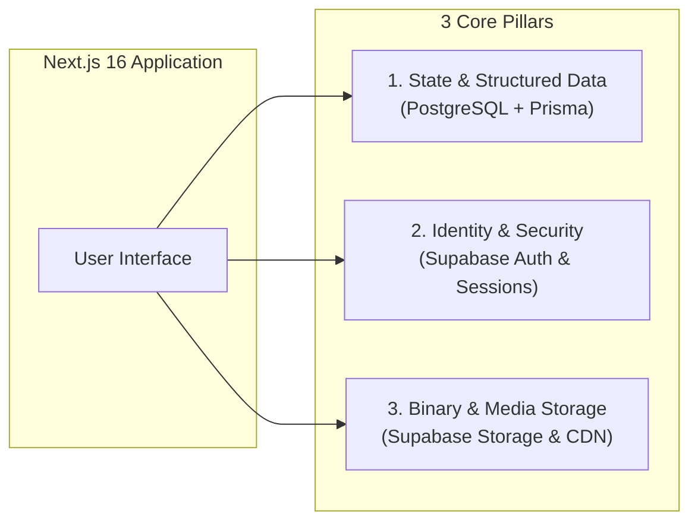
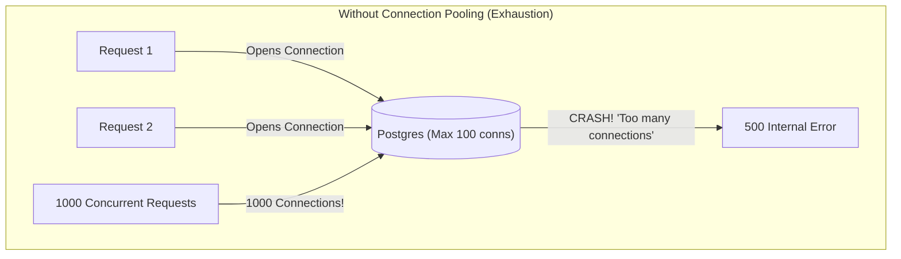
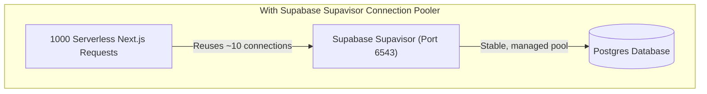
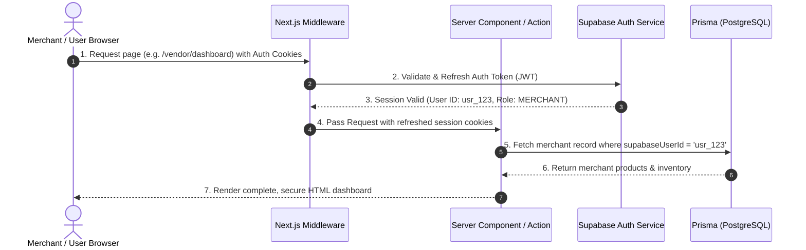
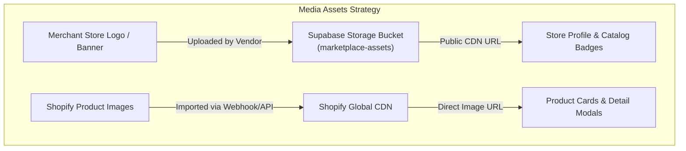
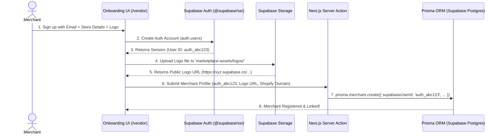

# Deep Dive: Modern Database, Auth & Storage Architecture
### Next.js 16 + Prisma ORM + Supabase Explained from First Principles

---

## Table of Contents
1. [The 3 Core Pillars of a Web Application](#1-the-3-core-pillars-of-a-web-application)
2. [Demystifying the Tools: Supabase vs. Alembic vs. Prisma](#2-demystifying-the-tools-supabase-vs-alembic-vs-prisma)
3. [The Database Layer: PostgreSQL, Prisma & Connection Pooling](#3-the-database-layer-postgresql-prisma--connection-pooling)
4. [The Identity & Auth Layer: How `@supabase/ssr` Works in Next.js](#4-the-identity--auth-layer-how-supabasessr-works-in-nextjs)
5. [The Media Storage Layer: Supabase Storage vs. Shopify CDN](#5-the-media-storage-layer-supabase-storage-vs-shopify-cdn)
6. [End-to-End Architectural Workflows](#6-end-to-end-architectural-workflows)
7. [Summary & Why This Setup is Optimal](#7-summary--why-this-setup-is-optimal)

---

## 1. The 3 Core Pillars of a Web Application

Every full-stack web application (including this Dropshipping Marketplace) requires three fundamental systems:



1. **Structured Data (Database)**: Storing records with strict relationships (Merchants, Products, Inventory levels, Sync logs).
2. **Identity & Auth (Security)**: Knowing *who* is making a request (Admin, Merchant, Public Visitor) and protecting sensitive routes and actions.
3. **Blob / Object Storage (Media)**: Storing heavy binary files like merchant store logos and promotional banners without bloating the database.

---

## 2. Demystifying the Tools: Supabase vs. Alembic vs. Prisma

To understand why we chose what we chose, let's categorize each tool by what layer it operates in:

```
┌──────────────────────────────────────────────────────────────────┐
│                      APPLICATION CODE (TypeScript)               │
│                                                                  │
│  [ Prisma ORM ]           [ @supabase/ssr ]       [ Storage SDK ]│
│  (Database Queries)       (Auth & Cookies)        (File Uploads) │
└─────────┬─────────────────────────┬──────────────────────┬───────┘
          │ (SQL / Queries)         │ (JWT / Session)      │ (Files)
          ▼                         ▼                      ▼
┌──────────────────────────────────────────────────────────────────┐
│                    SUPABASE CLOUD INFRASTRUCTURE                 │
│                                                                  │
│  [ Managed Postgres ]     [ GoTrue Auth Engine ]  [ S3 Storage ] │
│  (Port 6543 / 5432)       (User Accounts & MFA)   (Asset CDN)    │
└──────────────────────────────────────────────────────────────────┘
```

### Why was "Supabase vs. Alembic" an apples-to-oranges question?

* **Supabase** is a **cloud infrastructure platform** (Backend-as-a-Service). It gives you a fully managed PostgreSQL database, authentication service, and file storage in the cloud.
* **Alembic** is a **Python migration tool** built for the Python `SQLAlchemy` ORM. It generates Python scripts to alter database tables.
* **Prisma** is a **TypeScript/JavaScript ORM & migration engine**. It is the Node/TypeScript equivalent of SQLAlchemy + Alembic.

> [!NOTE]
> Since this project is built with **Next.js 16 + TypeScript**, **Prisma** is already your TypeScript migration and query tool. **Supabase** is the hosted cloud platform where your PostgreSQL database, Auth, and Storage live.

---

## 3. The Database Layer: PostgreSQL, Prisma & Connection Pooling

### What is an ORM (Object-Relational Mapping)?
Instead of writing raw SQL strings manually:
```sql
-- Raw SQL: Prone to typos, no type safety
SELECT * FROM merchants WHERE id = '123' AND status = 'ACTIVE';
```
Prisma lets you write type-safe TypeScript:
```typescript
// Prisma: Auto-completed by TypeScript, 100% type-safe
const merchant = await prisma.merchant.findUnique({
  where: { id: "123", status: "ACTIVE" },
  include: { listings: true }
});
```

### The Serverless Connection Problem & Connection Pooling
In Next.js (especially deployed to Vercel or cloud containers), each incoming API request or Server Action can spin up an isolated, temporary serverless execution context.





### Why we have two database URLs in `.env`:
1. `DATABASE_URL` (Port `6543`): Connects to the **Supavisor Transaction Pooler**. Used by Next.js at runtime to handle thousands of fast concurrent queries without exhausting database connections.
2. `DIRECT_URL` (Port `5432`): Connects **directly** to PostgreSQL. Used exclusively by `prisma migrate` when creating/altering tables, because database schema migrations require persistent session-level SQL commands (like locking tables).

---

## 4. The Identity & Auth Layer: How `@supabase/ssr` Works in Next.js

### Why Traditional Auth (LocalStorage) Fails in Next.js App Router
* In traditional Single Page Apps (React SPA), JWT tokens were saved in browser `localStorage`.
* But in **Next.js App Router**, pages are rendered on the **server** (Server Components). The server cannot read browser `localStorage`!
* If auth tokens are in `localStorage`, the server renders a blank or "Logged Out" state, causing layout flashes and SEO failures.

### The Modern Solution: Encrypted HTTP Cookies via `@supabase/ssr`



1. **Security**: Tokens are stored in secure, `HttpOnly`, `SameSite` cookies (immune to XSS script theft).
2. **Server-Side Rendering**: Server Components can read the session before rendering HTML.
3. **Automatic Refreshing**: Next.js `middleware.ts` automatically refreshes expiring access tokens seamlessly in the background without logging the user out.

---

## 5. The Media Storage Layer: Supabase Storage vs. Shopify CDN

Our dropshipping marketplace deals with two distinct types of images:

| Media Category | Best Location | Why? |
| :--- | :--- | :--- |
| **Merchant Store Logos & Banners** | **Supabase Storage** (`marketplace-assets` bucket) | Uploaded directly by merchants during onboarding. Gives us full control over uploads, size limits, and access control. |
| **Product Catalog Photos** | **Shopify CDN** | Synced from merchant Shopify stores. Shopify already optimizes, resizes, and serves these via a global high-speed multi-region edge CDN for free. |



---

## 6. End-to-End Architectural Workflows

### How a New Merchant Joins the Platform:



---

## 7. Summary & Why This Setup is Optimal

| Feature | How It Is Implemented | Major Benefit |
| :--- | :--- | :--- |
| **Language & Type Safety** | TypeScript end-to-end with Prisma Client | Zero runtime type errors between database schemas and UI components. |
| **Database Scalability** | Managed Postgres on Supabase with Supavisor | Handles unlimited serverless connections without crashing. |
| **Authentication** | Supabase Auth via `@supabase/ssr` & Next.js Middleware | Robust cookie session handling, multi-role security, and zero auth maintenance. |
| **File Management** | Supabase Storage S3 buckets + Shopify CDN | High performance, instant image delivery, zero storage overhead on our servers. |
| **Developer Experience** | Prisma migrations (`prisma migrate dev`) + Supabase dashboard | Instant schema diffing, automated migration history, and visual database browsing. |
